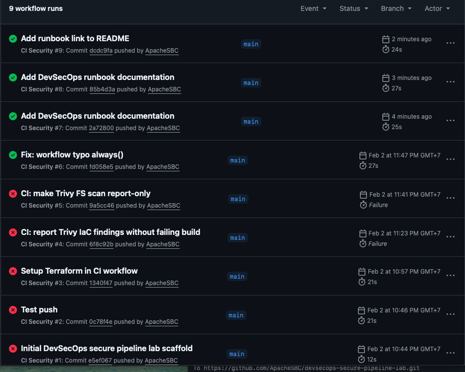
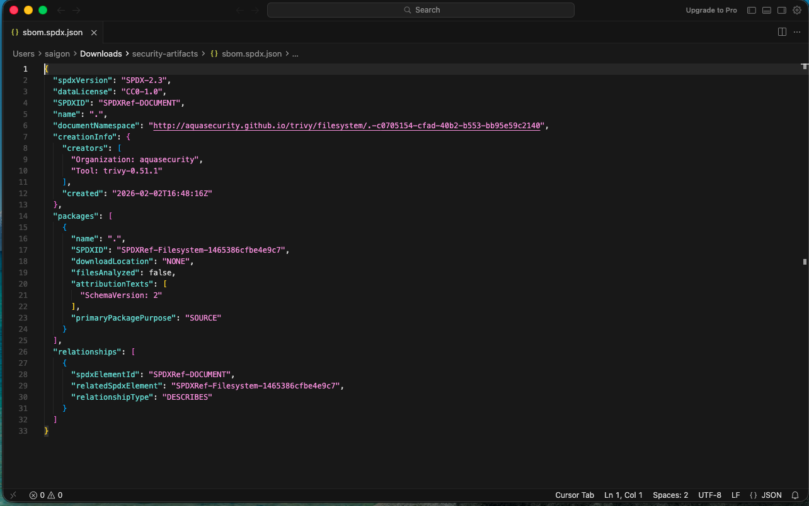

# DevSecOps Secure Pipeline Lab

A portfolio project demonstrating a secure CI pipeline for Infrastructure as Code (Terraform) with automated security scanning and severity gating.

📘 **Runbook / Notes:** [docs/devsecops-runbook.docx](docs/devsecops-runbook.docx)

## What this demonstrates
- GitHub Actions CI with security scanning (Trivy)
- Terraform IaC structure (modules + envs)
- SBOM generation and artifact upload
- Security gate: fail builds on High/Critical findings (configurable)

## Tech
- GitHub Actions
- Terraform (AWS)
- Trivy (FS + IaC + SBOM)

## CI pipeline stages
1. Checkout
2. Terraform format check
3. Trivy filesystem scan (repo)
4. Trivy IaC scan (Terraform)
5. Generate SBOM (SPDX)
6. Upload results as build artifacts
7. Gate on severity

## Roadmap
- Add secret scanning (Gitleaks)
- Add policy-as-code (OPA/Conftest)
- Add CD workflow (terraform plan/apply with approvals)
 devsecops-secure-pipeline-lab
Prove you can build a secure CI/CD pipeline that deploys real AWS infrastructure via Terraform, with security gates.

## CI Evidence

### GitHub Actions Runs

### SBOM Output (SPDX)

